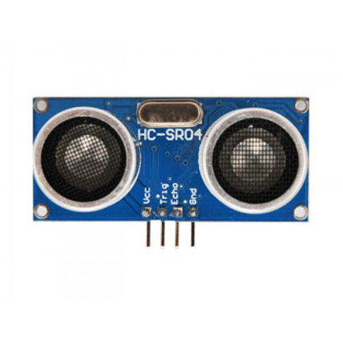
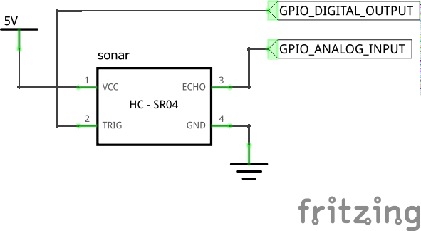

# Serial communication example with ChibiOS on STM32 and Java Server

This shows a simple example of serial communication between
* ChibiOS-based firmware running on STM32 ARM MCU (the client)
* Simple Java SE application (the server)

The client gets data from an HC SR-04 ultrasonic distance sensor, and transmit to a virtual serial port.

The example is made on a Windows system, with a coordinated baudrate of 38400 bps, and via the COM7 virtual serial port.
If you want to replicate the example on different enviroments, change baudrate and port number accordingly.

## Overview

    

The sensor used is an HC-SR04 ultrasonic distance sensor.
It's composed of a transmitter and a receiver of ultrasonic signals (the two cilinders) and some interal circuits.

The sensor provides four connection pins:
* `Vcc`: 5V reference voltage
* `Gnd`: reference ground
* `Trig`: send pulses to start measurement
* `Echo`: input signal kept high until measurement ends

To start measurement, the `Trig` pin must be set for at least 10 μs. A series of eight pulses will be then sent and `Echo` pin will be set.
When sound encounters an object, it's echoed back and the `Echo` pin is reset.

The ICU waits for the echoed square wave and measures its high period width. That measure represent the round-trip-time (aka RTT, it's MCU-to-object + object-to-MCU time), in term of system clock ticks.

To get the time in seconds, this value must be divided by the ICU timer frequency. We only need the MCU-to-object time, so we divide further by two. Finally, remembering that the speed of sound is (almost) constant, we can get the distance as multiplication of speed and time. The final formula is:

$$
d = \frac{v_{sound} \cdot t_{ticks}}{2 \cdot f_{timer}}
$$

## Connections to MCU

The following connections are necessary to the component to work properly:
* `Vcc` connected to MCU 5V pin
* `Gnd` connected to MCU GND pin
* `Trig` connected to a GPIO pin in OUTPUT mode
* `Echo` connected to a GPIO pin enabled for ICU input

    

Not all pins are enabled as ICU input, please refer to the board's *Reference Manual*

## Implementation

The example is organized in three threads:
* the main thread, sets the `Trig` pin in an infinite loop, starting a measurement each time
* the `serialThd`, sends measured distance to serial port at fixed time intervals
* the `alarmThd`, checks if measured distance goes below a fixed threshold. If that condition is true, then the on-board green LED is activated

The example has been made on a Nucleo64-F401RE board. On other boards, the on-board led might be named differently. Check your board's documentation.

The Java server is a simple, single-thread application that listens to the given serial port.

## Licensing

This repository is under MIT license. 
